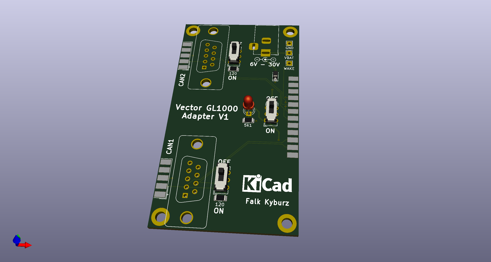

# Vector GL1000 Adapter

This is an adapter for the Vector GL1000 series of data loggers to adapt the D-SUB 25 connector to two 
D-SUB 9 standard CAN pinout connectors.

## BOM

I also included the interactive html BOM (gl1000adapter.html) 

| References     | Value                     | Footprint | Quantity |
|----------------|---------------------------|-----------|----------|
| R1             | 5k1                       | 1206      | 1        |
| R2, R3         | 120                       | 1206      | 2        |
| D1             | green                     | LED_3mm   | 1        |
| D2             | SM400                     | SOD-123   | 1        |
| SW1, SW2, SW3  | K3-2235D-K1 or similar    |           | 3        |
| J1             | DC005-T20 or similar      | 5.5/2.1mm | 1        |
| J3             | DB25 female               |           | 1        |
| J2, J4         | DB9 female                |           | 2        |
| J5, J6         | DB9 male vertical         |           | 2        |
